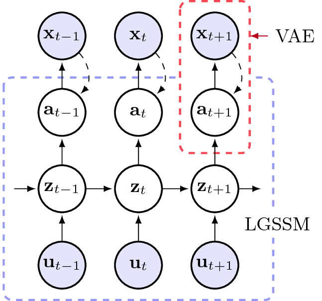
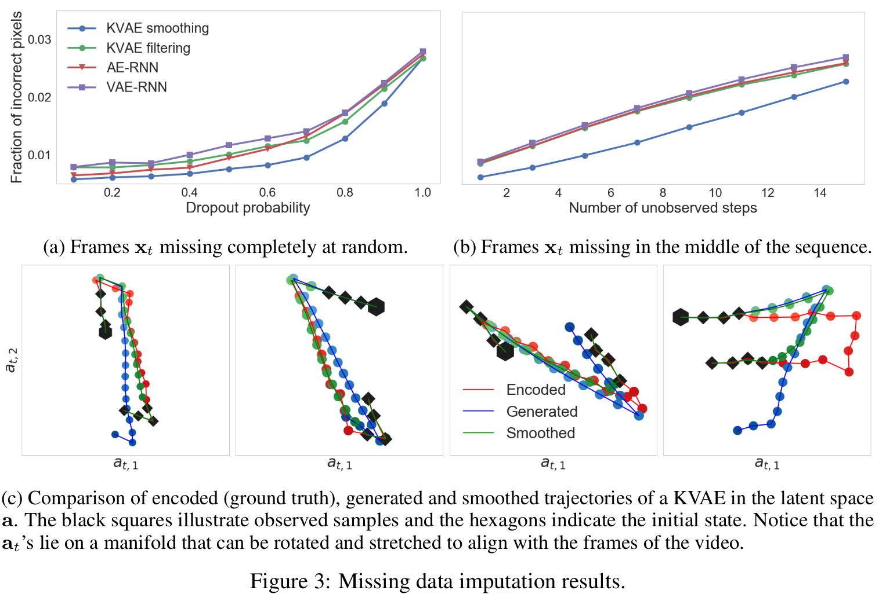

# Kalman Variational Auto-Encoder
This repository contains the code for the model introduced in the paper
> A Disentangled Recognition and Nonlinear Dynamics Model for Unsupervised Learning.  
> Marco Fraccaro*, Simon Kamronn*, Ulrich Paquet, Ole Winther  
> NIPS 2017, [arXiv:1710.05741](https://arxiv.org/abs/1710.05741)  
> <sub>* Equal contribution.</sub>

The Kalman variational auto-encoder is a framework for unsupervised learning of sequential data that disentangles two latent representations: an object’s representation, coming from a recognition model, and a latent state describing its dynamics. The recognition model is represented by a convolutional variational auto-encoder and the latent dynamics model as a linear Gaussian state space model (LGSSM).
<div style="text-align:center"></div>

## Main Results
As shown in the paper, the KVAE can be trained end-to-end, and is able learn a recognition and dynamics model from the videos. 
The model can be used to generate new sequences, as well as to do missing data imputation without the need to generate high-dimensional frames at each time step.
<div style="text-align:center"></div>

### Videos
Videos of simulations are available for many of the experiments here: [link](https://sites.google.com/view/kvae/home).

## Installation instructions
The Kalman Variational Auto-Encoder (KVAE) package can be installed running
```
# Install requirements
pip install tensorflow-gpu numpy pandas matplotlib seaborn

# Clone the kvae repository and install it
git clone https://github.com/simonkamronn/kvae
cd kvae
pip install -e .
```

### Dependencies
- Python >= 2.7 or 3.5
- Tensorflow >= 1.1

### Data
The data used in the experiments is available for download here: [link](https://archive.compute.dtu.dk/files/public/users/marco/kvae). Once downloaded, it needs to be placed in the `data` folder in the root directory.
In Linux you can download the data by running from the root directory:
```
wget https://archive.compute.dtu.dk/archives/public/users/marco/kvae/data.zip
unzip data.zip
```
Alternatively, you can also find the data here: [link](https://drive.google.com/drive/folders/0B7BmG5ubHI3UeDNLbVVXWDRVUnM?usp=sharing)
The scripts we used to generate the video sequences can be found in `kvae/datasets`, and depend on pygame and the pymunk physics engine (and their dependencies).


## Usage Example
In the `examples` folder execute the command
```
python run_kvae.py  --gpu=0
```
to train a model using the default bouncing ball dataset and parameters. To train a model with different parameters run
```
python run_kvae.py  --help
```
to view the configuration options or look in `kvae/utils/config.py`. Further details on the experimental setup can be found in the paper and in the supplementary material.
Plots and videos generated during training can be found in `examples/logs`.

## Citing
```
@article{Fraccaro2017,
    Author = {Marco Fraccaro, Simon Kamronn, Ulrich Paquet, Ole Winther},
    Title = {A Disentangled Recognition and Nonlinear Dynamics Model for Unsupervised Learning},
    Journal = {Advances in Neural Information Processing Systems 30, NIPS},
    Year = {2017}
}
```
## License
* Free software: MIT license
